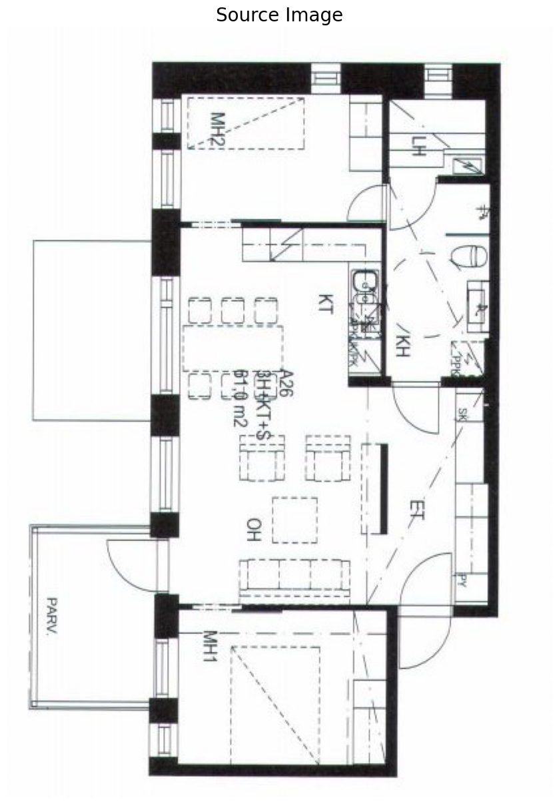

## 代码使用说明

这份代码用于处理和分析房屋平面图的图像数据，包括了对图像的分割和预测。以下是代码的详细说明以及如何使用它。

### 环境设置

确保您的环境满足以下要求：

- Python 3.7.1
- 相关的Python库（如PyTorch、NumPy、Matplotlib等）
- 适配的GPU设备（用于模型训练）
- 数据集和权重文件

### 数据集

数据集链接在下面，存放在了谷歌云盘上，如果您采用Colab平台来运行此代码，则只需将次数据集保存到您自己的谷歌云盘上即可，并不用下载到本地。如果您在本地环境中进行实验，需要将数据集下载到本地PC。如果该链接失效，请发邮件联系我。

``` 
songxiang@whu.edu.cn
```


https://drive.google.com/file/d/1kerJhB7uQygr9tah_qfQxU5ylvIxssdi/view?usp=sharing

### 权重文件

权重文件的下载链接如下，其相关使用方法同数据集。

https://drive.google.com/file/d/1aEzLR9MNVbXv4CtLgUgUQ5_xAzr0Ae1i/view?usp=sharing

### 使用Google Colab

此代码示例是在Google Colab上运行的。在Colab中，您可以运行Jupyter Notebook，使用云端GPU进行模型训练和图像处理。如果您想在Colab上运行此代码，请按照以下步骤操作：

1. 克隆GitHub仓库：

```
!git clone https://github.com/CubiCasa/CubiCasa5k
```

1. 连接到Google Drive：

```
from google.colab import drive
drive.mount('/content/drive')
```

1. 进入CubiCasa5k目录：

```
cd CubiCasa5k/
```

1. 列出当前目录下的文件：

```
!ls
```

1. 解压数据文件：

```
from zipfile import ZipFile
file = "/content/drive/MyDrive/cubicasa5k.zip"
with ZipFile(file, 'r') as zip:
  zip.printdir()
  print('Extracting all the files now...')
  zip.extractall()
  print('Finished!')
```

1. 安装所需的Python库：

```
!pip install svgpathtools
!pip install lmdb
!pip install matplotlib==3.7.1
```

1. 运行示例代码：

这是一个示例代码，您可以根据自己的需求来修改和扩展它。

### 示例代码解析

此代码示例演示了如何使用深度学习模型对房屋平面图的图像数据进行处理和分析。以下是示例代码的主要部分：

- 加载图像和数据集：首先，代码加载了房屋平面图的图像数据和相关的数据集。
- 设置深度学习模型：使用PyTorch创建和设置了深度学习模型，该模型用于对图像进行分割和预测。
- 图像处理和分割：代码对图像进行分割和处理，包括对房间和图标进行分类，提取图像中的信息。
- 可视化结果：最后，代码展示了对分割和处理后的图像进行可视化的结果，包括房间和图标的标记。

请注意，此示例中使用了Colab上的GPU进行加速，如果您在本地运行代码，可能需要根据您的硬件和环境进行相应的调整。

### 注意事项

- 此示例代码中使用了Colab上的GPU，如果在本地运行，需要安装适当的GPU驱动和相关软件。
- 示例中的模型和数据集是为了演示目的而提供的，实际应用中需要根据项目需求选择适当的数据集和模型。
- 示例代码中的图像分割和处理算法是简化的，实际应用中可能需要更复杂的处理和优化。
- 本示例主要用于展示如何在Google Colab上运行深度学习代码，以及如何处理房屋平面图像数据。

### 代码结果




