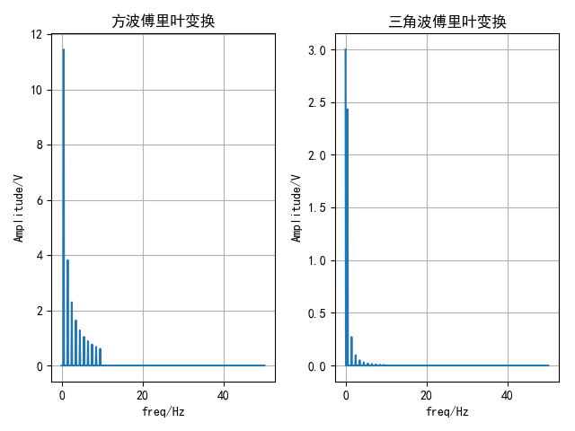

# 谐波合成和频谱分析实验

[^宋翔]: 邮箱：2021302121170@whu.edu.cn

这个项目旨在演示如何使用Python中的NumPy和Matplotlib库进行谐波合成和频谱分析实验。谐波合成是通过将多个谐波分量相加来合成不同波形的技术，而频谱分析是分析信号的频域特性。在这个项目中，我们将分析方波和三角波的合成以及它们的频谱。

## 环境设置

确保您的Python环境满足以下要求：

- Python 3.6.9
- NumPy 1.19.5
- Matplotlib 2.2.3

## 安装依赖

您可以使用以下命令安装项目所需的依赖：

```
pip install numpy==1.19.5
pip install matplotlib==2.2.3
```

## 程序架构

这个项目包括以下主要模块和功能：

- `oddHarmonic`: 奇次谐波的主要函数

## 函数说明

该函数为奇次谐波

``` 
def oddHarmonic(n):
    t = np.arange(0, 0.1, 0.0001) # 定义时间变量,10000hz
    y = (12 / np.pi) * np.sin( 2 * np.pi * 50 * n * t ) / n # 定义奇次谐波函数
    return y

```


## 合成方波

### 基本概念

合成方波是通过组合不同谐波分量来创建一个方波信号。在这个实验中，我们将合成方波，逐步添加不同的谐波分量，从基本的基波到多个奇次谐波。

### 19次谐波合成方波代码如下

``` python
# (e)19次，用循环的方式来写
y4 = oddHarmonic(1)
for i in range(3, 20, 2):
    y4 += oddHarmonic(i)
```

### 生成的方波如下


## 合成三角波

### 基本概念

三角波是另一种常见的波形，它可以通过谐波合成方法创建。在这个实验中，我们将合成三角波，并观察不同谐波分量的影响。

### 代码

```python
# 创建一个名为“三角波合成”的图形窗口
plt.figure(num="三角波合成")

# 幅值为2，频率为0.5Hz
E = 2
f0 = 0.5

# t变化为100Hz
t = np.arange(0, 10, 0.01)
ytrig = E / 2
# n取1-19的奇数，当n取偶数的时候，该a_n为0，所以只剩下cos这一项
for n in range(1, 20, 2):
    ytrig += (4 * E / np.pi ** 2) * (np.cos(n * 2 * np.pi * f0 * t)) / n ** 2
# 画出三角波
plt.plot(t, ytrig)
plt.grid(True)
plt.show()
```

### 三角波


## 频谱分析

### 基本概念

频谱分析是一种用于分析信号在频域中的特性的技术。在这个实验中，我们将分析合成的方波和三角波的频谱，以查看它们的频域表示。

### 代码

```python
# 设计分析方波、三角波频谱的分析实验
# 创建一个名为“频谱分析”的图形窗口
plt.figure(num="频谱分析")
Fs = 100               # 采样率1000HZ
N = 1000

# 方波傅里叶变换
yfft = 3 * np.abs(np.fft.fft(y4) / N)
yfft = yfft[:N // 2 + 1]
yfft[1:-1] = 2 * yfft[1:-1]
F = Fs * np.arange(N // 2 + 1) / N
plt.subplot(1, 2, 1)
plt.plot(F, yfft)
plt.title(u'方波傅里叶变换')
plt.xlabel('freq/Hz')
plt.ylabel('Amplitude/V')
plt.grid(True)

# 三角波傅里叶变换
yfft = 3 * np.abs(np.fft.fft(ytrig) / N)
yfft = yfft[:N // 2 + 1]
yfft[1:-1] = 2 * yfft[1:-1]
F = Fs * np.arange(N // 2 + 1) / N
plt.subplot(1, 2, 2)
plt.plot(F, yfft)
plt.title('三角波傅里叶变换')
plt.xlabel('freq/Hz')
plt.ylabel('Amplitude/V')
plt.grid(True)

plt.tight_layout()

plt.show()
```

### 频谱图



## 结论

这个项目展示了如何使用Python进行谐波合成和频谱分析实验。通过合成方波和三角波，并分析它们的频谱，我们可以更好地理解信号处理和频域分析的基本原理。您可以根据实验结果来进一步探索不同波形的合成和分析。