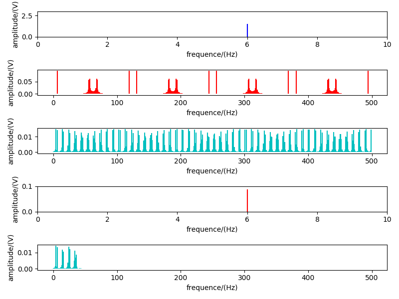

## 信号处理与频谱分析

这个项目旨在演示如何使用Python中的NumPy、Scipy和Matplotlib库进行信号处理和频谱分析。信号处理是一项重要的工程任务，包括合成、采样、滤波和频谱分析等。在这个项目中，我们将演示如何生成和处理不同类型的信号，然后分析它们的频谱特性。

### 环境设置

确保您的Python环境满足以下要求：

- Python 3.6.9
- NumPy 1.19.5
- Scipy 1.5.4
- Matplotlib 2.2.3

### 安装依赖

您可以使用以下命令安装项目所需的依赖：

```
pip install numpy==1.19.5
pip install scipy==1.5.4
pip install matplotlib==2.2.3
```

### 信号处理与频谱分析功能

#### 生成方波、正弦波和三角波

- `Rec_wave(x, A)`: 生成方波信号，输入参数包括时间数组 `x` 和幅度 `A`。
- `Show_sin()`: 生成正弦波信号，并展示正常采样、欠采样和还原信号的效果。
- `Show_rec()`: 生成方波信号，并展示正常采样、欠采样和还原信号的效果。
- `Show_trg()`: 生成三角波信号，并展示正常采样、欠采样和还原信号的效果。

#### 频谱分析

- `Fre_ampl(x, y)`: 计算信号的频谱，输入参数包括时间数组 `x` 和幅度数组 `y`，返回频率数组和幅度数组。

### 如何运行

1. 安装所需依赖。
2. 运行 `Lab2.py` 文件以生成和处理不同类型的信号，并进行频谱分析。

### 结果展示

通过运行 `Lab2.py` 文件，您将看到生成的信号图形和频谱分析图形，以及对信号进行采样和还原的效果展示。这有助于理解信号处理和频谱分析的基本原理，以及采样对信号特性的影响。

这里以正弦信号为例，波形图如下

