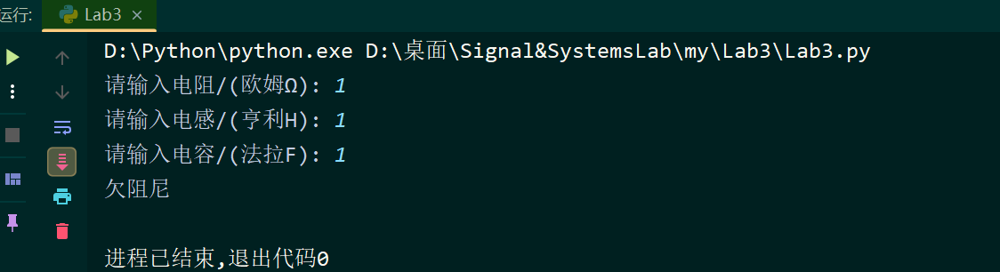
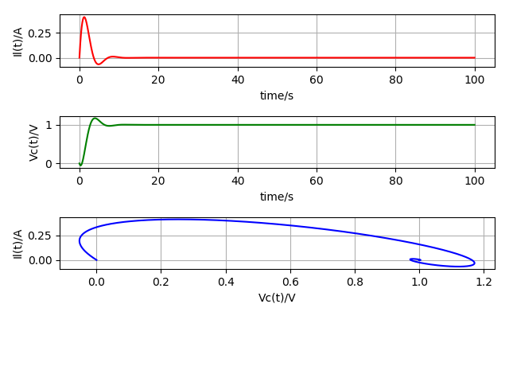

## RLC电路响应模拟

这个项目旨在模拟RLC电路中电流和电压的响应，根据输入的电阻、电感和电容数值。RLC电路是一个重要的电子电路，用于控制电流和电压的传输和响应。通过这个模拟，您可以了解不同阻尼状态下电流和电压的行为。

### 环境设置

确保您的Python环境满足以下要求：

- Python 3.6.9
- Matplotlib 2.2.3
- Scipy 1.5.4
- NumPy 1.19.5

### 安装依赖

您可以使用以下命令安装项目所需的依赖：

```
pip install matplotlib==2.2.3
pip install scipy==1.5.4
pip install numpy==1.19.5
```

### 使用方法

1. 运行 `Lab3.py` 文件。
2. 输入电阻、电感和电容的数值，以模拟不同阻尼状态下的电流和电压响应。

### 模拟电路响应

模拟过程将根据输入的电阻、电感和电容数值，计算电路的阻尼系数和谐振角频率，并根据不同状态计算电流和电压的响应。根据阻尼状态的不同，电流和电压的行为会有所不同，包括过阻尼、临界阻尼、欠阻尼和无阻尼状态。

### 结果展示

通过运行 `Lab3.py` 文件，您将看到生成的电流和电压的响应图形，以及电流与电压之间的关系图。这将有助于理解RLC电路在不同阻尼状态下的行为，并为电路设计和分析提供有用的参考。

#### 举个例子



