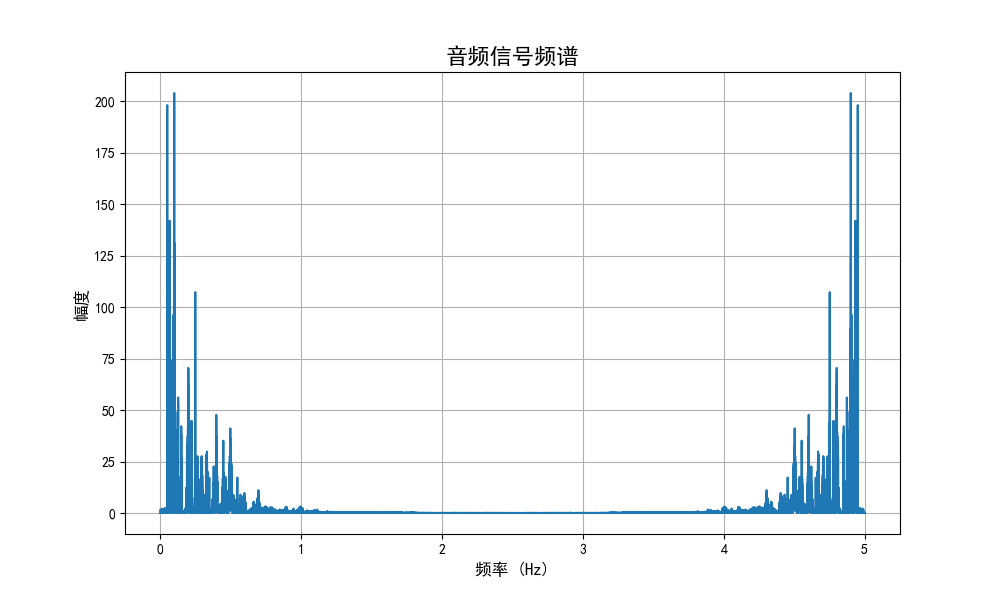
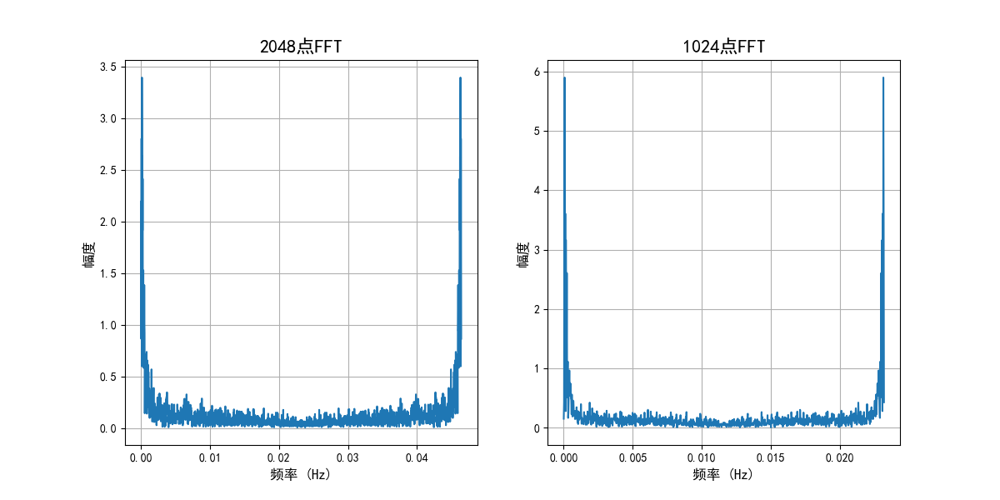
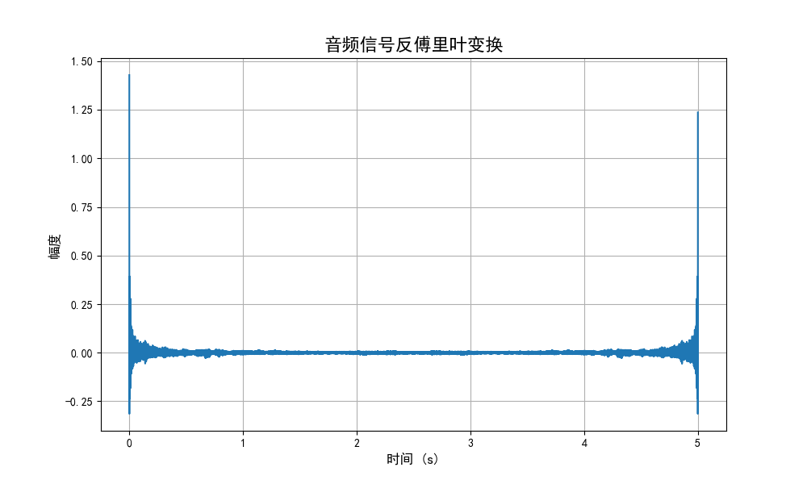
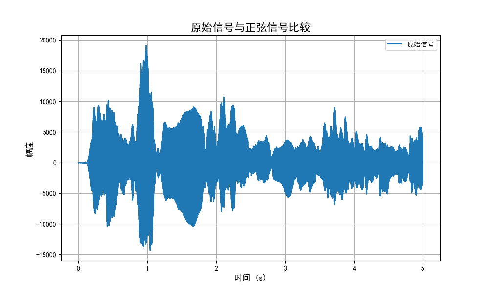

## 音频信号分析与合成

这段Python代码用于分析音频信号的频谱成分，进行傅里叶变换与逆变换，并合成一个与原始信号具有相同幅度的正弦波。以下是代码的说明以及如何使用它。

### 环境设置

确保您的Python环境满足以下要求：

- Python 3.6.9
- NumPy 1.19.5
- Matplotlib 2.2.3
- Scipy 1.5.4
- Sounddevice 0.4.4

您可以使用以下命令安装所需的依赖：

```
pip install numpy==1.19.5
pip install matplotlib==2.2.3
pip install scipy==1.5.4
pip install sounddevice==0.4.4
```

### 使用方法

1. 在代码中指定要分析的音频文件的路径（变量 `filename`）。
2. 运行代码，它将加载音频文件并执行以下操作：
   - 计算音频信号的FFT并绘制频谱图。
   - 计算不同点FFT的频谱并绘制比较图。
   - 执行傅里叶逆变换，并绘制反变换后的音频信号。
   - 查找并构造与最大幅度正弦分量相等的正弦信号。
   - 比较原始信号与构造的正弦信号。

### 分析音频信号

该代码分析所选音频文件的频谱成分，可视化音频信号的频域特征，显示不同点FFT的频谱图，并执行傅里叶逆变换以获得原始信号。此外，它还查找并合成了一个具有与最大正弦分量相同幅度的正弦信号，以便与原始信号进行比较。

### 结果展示

通过运行代码，您将看到多个图形，包括音频信号的频谱、不同点FFT的频谱比较、傅里叶逆变换后的音频信号，以及原始信号与构造的正弦信号的比较。这有助于您更好地了解音频信号的频谱特征，并进行傅里叶分析与合成。同时，最大幅度的正弦信号将通过音频输出进行播放。







