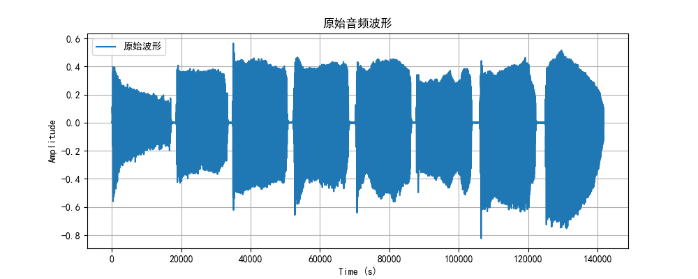
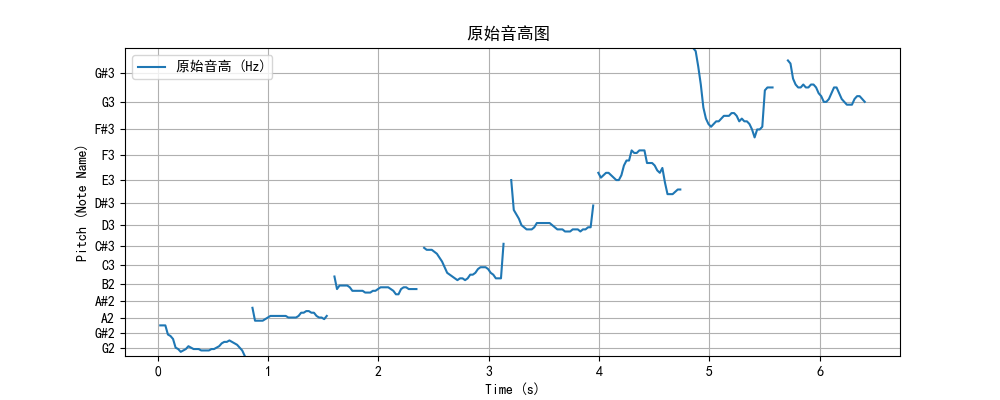
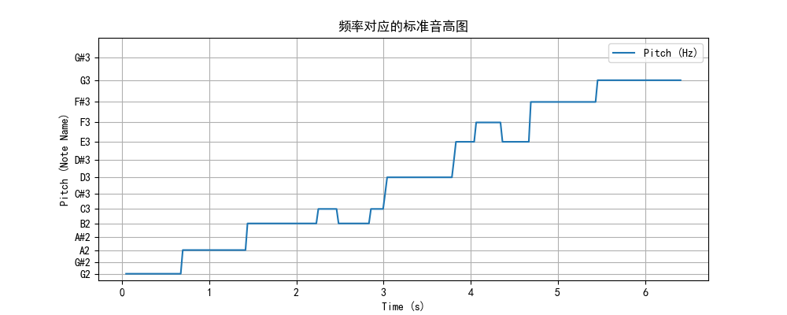

## 音高分析和中值滤波

这段Python代码用于分析音频文件中的音高（频率）信息，对音频信号进行预加重滤波，并通过中值滤波对音高进行平滑处理。以下是代码的说明以及如何使用它。

### 环境设置

确保您的Python环境满足以下要求：

- Python 3.6.9
- librosa 0.9.2
- Matplotlib 2.2.3
- NumPy 1.19.5
- Scipy 1.5.4

您可以使用以下命令安装所需的依赖：

```
pip install librosa==0.9.2
pip install matplotlib==2.2.3
pip install numpy==1.19.5
pip install scipy==1.5.4
```

### 使用方法

1. 在代码中指定要分析的音频文件的路径（变量 `audio_file`）。
2. 根据需要，您可以调整预加重滤波的参数（`pre_emphasis_coefficient`）。
3. 运行代码，它将执行以下操作：
   - 读取音频文件并执行预加重滤波以增强高频成分。
   - 提取音频信号的音高信息。
   - 绘制原始音频波形图。
   - 绘制原始音高图。
   - 绘制经过中值滤波处理后的音高图像。

### 分析音高

该代码使用librosa库从音频文件中提取音高信息。它还执行预加重滤波以增强信号中的高频成分，平滑音频信号的频谱特性。提取的音高信息通过频率表示（Hz）并在图形上显示。

### 预加重滤波

在音频处理中，预加重滤波是一种用于提高高频信号成分的技术。它有助于突出高频细节，通常用于声音分析和音高提取。

### 结果展示

通过运行代码，您将看到多个图形，包括原始音频波形、原始音高图以及经过中值滤波处理后的音高图像。这有助于您更好地了解音频文件的音高分布情况，特别是在进行音乐分析或声音处理时。

请注意，您可以根据需要对预加重滤波参数进行调整，以适应不同的音频信号和分析需求。





